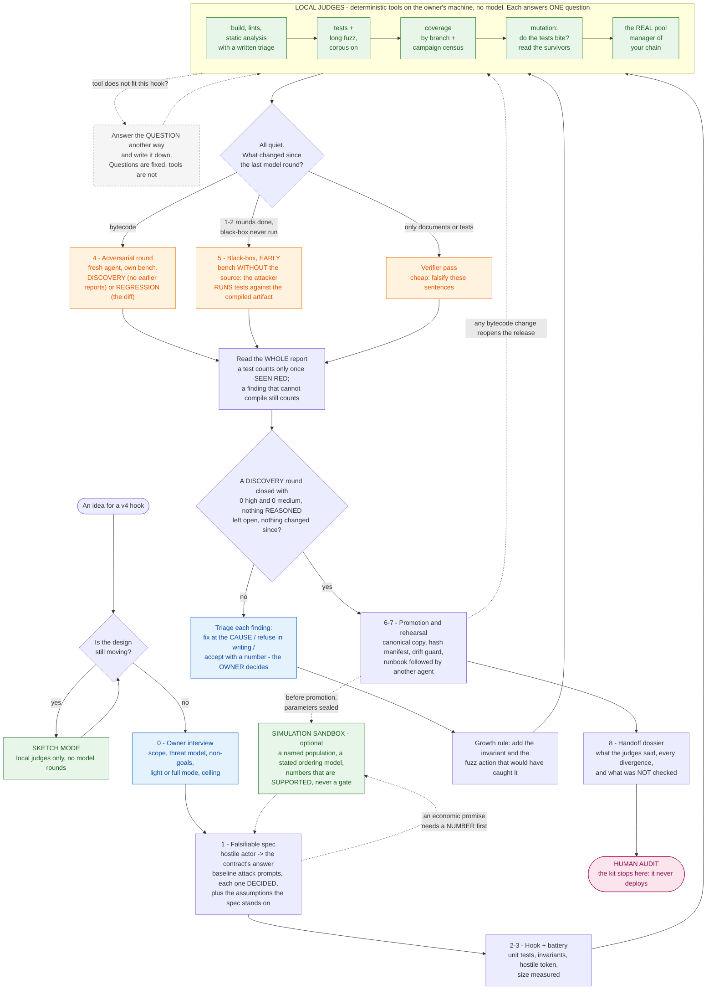

# The route

The nine-phase route, in one picture. `AGENTS.md` is the agent-facing entry point; the canonical text is
[`skills/hook-gauntlet/references/AGENTS.md`](../skills/hook-gauntlet/references/AGENTS.md).

## In one picture

Green runs locally: deterministic tools on your own CPU, no model involved. Orange is a round run by a model, and
spends tokens - so the table in [`skills/hook-gauntlet/references/NEXT.md`](../skills/hook-gauntlet/references/NEXT.md) never
reaches an orange box while a green one still has something to say. Blue is the owner's decision, never the agent's.
The grey box is the rule that keeps this from being a checklist: **the questions are fixed, the tools are not**
([`AGENTS.md`](../AGENTS.md) section 6b, [`skills/hook-gauntlet-battery/references/JUDGES.md`](../skills/hook-gauntlet-battery/references/JUDGES.md)).

## What comes out at the end

The handoff dossier ([`skills/hook-gauntlet-dossier/references/handoff-dossier.md`](../skills/hook-gauntlet-dossier/references/handoff-dossier.md)), assembled from files the route already
produced. Its sections, because they say more about this kit than any description of it:

1. **Scope sheet** - the exact commit, files in and out of scope, compiler and its known bugs, sizes, bytecode hashes,
   deployment parameters, trusted periphery, tokens supported, who holds which key.
2. **What it is and what it promises** - the hostile-actor table: what an attacker can do, what the contract answers,
   the test that proves it, the fuzz action that reaches it, the mutant that test was seen to kill. Empty cells stay empty.
3. **Access control** - every entry point, who may call it, what happens to everyone else.
4. **Known issues and accepted trade-offs** - each with a number, and who accepted it.
5. **What the judges said** - one row per tool, with the result read from its output, not from its exit code.
6. **The adversarial history** - every round, what it found, what was done about it.
7. **Where we diverged from the usual process**, and why.
8. **What was NOT checked** - the section an auditor reads first. It may not be empty.
9. **Reproduce it** - the commands that regenerate the numbers above.

## What is in the kit

- **Doctrine** - the adversarial loop that makes successive audits converge instead of circling: one round at a
  time, read the whole report, fix the cause, write down the refusals, regression-test everything, re-measure.
  Plus: a decision table for "what do I do next", the eleven judges (ten deterministic tools and the simulation sandbox)
  with the question each one answers and how each one lies, what counts as evidence and how an agent fools itself, baseline prompts for things that go wrong in v4 hooks, how to derive your own invariants and fuzz actions, and when
  the agent may diverge from all of it.
- **Briefs** - parameterised templates for each role: audit round, verifier, black-box attacker, executor with
  gates, promotion, owner interview, spec, and the handoff dossier a human auditor reads.
- **A state convention** - three files in your project (`STATE.md`, `DECISIONS.md`, `LOG.md`) so an
  agent with no context can read them and continue.
- **A Foundry kit** - a hostile token mock with per-wallet switches, an invariant skeleton with a call-and-success
  census, and a worked toy example. The v4 module (`skills/hook-gauntlet-battery/foundry-kit/v4/`) runs one suite against two pool managers - compiled from source, or the real
  bytecode of the one deployed on your chain - mines the hook address for its permission bits, and ships a small
  worked hook.
- **Scripts** - full battery, long fuzz, the campaign census (what the fuzzer actually reached, added up over every
  run), per-agent bench, publication guard, aimed mutants and variants, sizes, the pinned Uniswap sources, the real
  bytecode of the pool manager on your chain - and a self-test that makes every one of those guards go red on purpose.
- **Adapters** - a thin layer per tool. The core is plain Markdown and plain bash and depends on no vendor feature.

